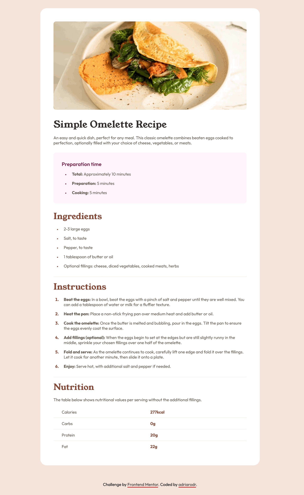

# Frontend Mentor - Recipe page solution

This is a solution to the [Recipe page challenge on Frontend Mentor](https://www.frontendmentor.io/challenges/recipe-page-KiTsR8QQKm). Frontend Mentor challenges help you improve your coding skills by building realistic projects. 

## Table of contents

- [Overview](#overview)
  - [The challenge](#the-challenge)
  - [Screenshot](#screenshot)
  - [Links](#links)
- [My process](#my-process)
  - [Built with](#built-with)
  - [What I learned](#what-i-learned)
  - [Useful resources](#useful-resources)
- [Author](#author)

## Overview

## The challenge

The challenge is to recreate the recipe page from the screenshot on the challenge page as closely as possible. We can use any tools, such as CSS preprocessors, Bootstrap, Tailwinds, or plain HTML and CSS. The main focus is on using semantic HTML and CSS styling while ensuring the design is responsive.

### Screenshot

### Links

- Solution URL: 
- Live Site URL: 

## My process

### Built with

- Semantic HTML5 markup
- CSS custom properties
- Mobile-first workflow

### What I learned

I used this project to reinforce what I have learned in my web development and web development tools classes. I used the proper semantic HTML5 markup to enhance accessibility. I followed the mobile-first approach as the mobile design was simpler, so it helped limit the need to undo and overwrite CSS properties for tablet and desktop versions. During this challenge, I learned about not obsessing over pixel-perfection, validating HTML and CSS files, heading hierarchy, and making data tables accessible. 

While replicating the designs, I realized that obsessing over pixel-perfection is impractical because of the inconsistencies between screens and browsers. Instead, it’s more important to maintain consistency in the design and ensure it looks great across multiple platforms. 

I learned in my classes that validating HTML and CSS files is a crucial part of the development process. This step allowed me to identify and correct errors, enhancing my code quality. Another critical aspect of the development process is testing accessibility using tools such as Lighthouse or WAVE Web Accessibility Evaluation Tools. WAVE taught me the importance of descending heading hierarchy on a webpage to improve accessibility. 

I also learned about the two types of tables: layout table and data table. The layout table is for presentation, whereas the data table is for data. With layout tables, it is better to use other HTML elements or assign the ARIA role of presentation to improve accessibility for screen readers. On the other hand, for data tables, the th tag is necessary for accessibility. 

### Useful resources

- [WAVE Web Accessibility Evaluation Tools](https://wave.webaim.org/) - This helped me check if my webpage was accessible and taught me that using the tag is required for data tables as it assists with accessibility.
- [W3C - Markup Validation Service](https://validator.w3.org/) - I used this site to validate the HTML for my webpage and assist me with correcting any errors.
- [W3C CSS Validation Service](https://jigsaw.w3.org/css-validator/) - I used this site to validate the CSS for my webpage and assist me with correcting any errors.
- [“Chasing the pixel-perfect dream” by Josh Comeau](https://www.joshwcomeau.com/css/pixel-perfection/) - This article helps read up on pixel-perfection and it's impracticality.

## Author

- Website - [adriarodr's github](https://github.com/adriarodr)
- Frontend Mentor - [@adriarodr](https://www.frontendmentor.io/profile/adriarodr)
